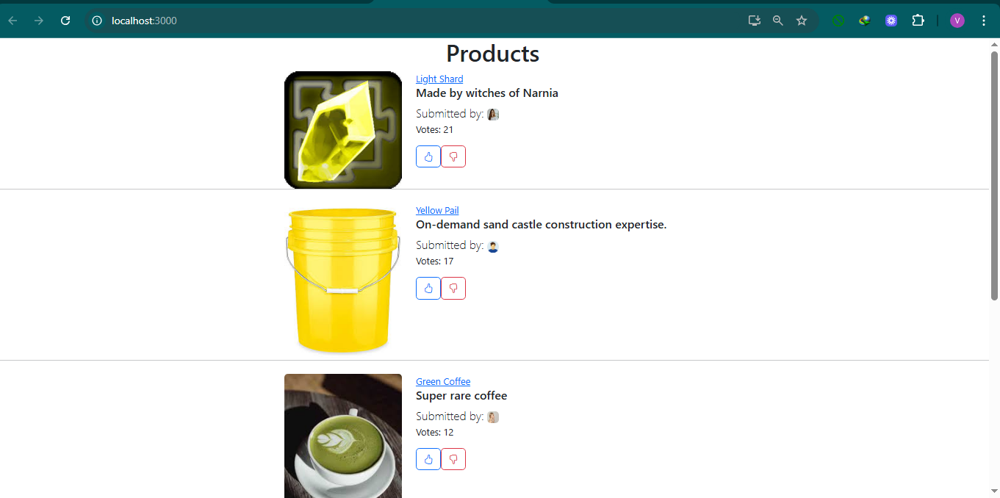

# React Voting app

This is a simple React app created using Create React app.
It allows you to upvote or downvote listed products.
The app is not stateful and any changes made do not persist if you refresh the browser/re-run it.

## App Preview



### Prerequisites

Node.js (v14 or later)
npm or yarn

### Installation

```bash/powershell
git https://github.com/Dev-VictorK/voting-react-app.git
cd voting-react-app
npm install
npm start

### Available Scripts

npm start : Runs the app locally in development mode
npm run build : builds the app for production
npm test : Runs tests

### Tech Stack

React
JavaScript
Bootstrap